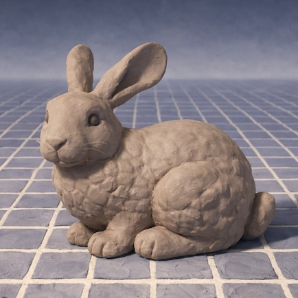

# Bunny



**Deterministic math, geometry, spatial query, broadphase, and mesh tools for
Rust graphics projects.**

Bunny is a lightweight, open-source Rust workspace for graphics-adjacent
primitives that need repeatable, bit-for-bit behavior across supported native
and WebAssembly targets.

It provides fixed-point scalar math, validated geometry types, deterministic ray
and closest-point queries, broadphase acceleration structures, quantized mesh
layouts, zero-copy mesh decoders, and schema-generated contract types. It does
not try to be a renderer, game engine, physics engine, editor framework,
database, or application runtime.

Named after the Stanford Bunny 3D test model, Bunny exists so downstream tools
can share the same geometry and mesh logic without inheriting each other's app
behavior.

## Why Bunny?

Graphics, simulation, and editor code often needs answers that stay identical
across machines. Tiny floating-point differences can change a ray hit, reorder a
collision candidate, perturb a mesh hash, or make a deterministic replay drift
from one target to another.

Bunny's answer is deliberately conservative:

- canonical math uses `FixedQ32_32`, a signed Q32.32 fixed-point type;
- float ingress and egress happen at explicit, validated boundaries;
- geometry constructors reject malformed shapes instead of normalizing surprises;
- golden-vector tests lock down exact raw outputs;
- native and WebAssembly quality gates run the same deterministic contract.

The goal is not to make every operation fast at any cost. The goal is to make
the result auditable, portable, and boring in the best way: the same input should
produce the same observable output on every supported target.

## What Bunny Provides

| Crate | What it does |
| --- | --- |
| `bunny-num` | Deterministic scalar profile and `FixedQ32_32` helpers. |
| `bunny-linalg` | Fixed-point 2D/3D vectors and unit-vector invariants. |
| `bunny-geom` | Validated rays, AABBs, spheres, and fixed/float conversion boundaries. |
| `bunny-query` | Deterministic ray intersections and closest-point solvers. |
| `bunny-broadphase` | BVH construction, BVH traversal helpers, and sweep-and-prune broadphase pairs. |
| `bunny-mesh` | Quantized vertex layouts, triangle buffers, and stable mesh hashes. |
| `bunny-codec` | Zero-copy OBJ/PLY parsers and Bunny compressed mesh decoding. |
| `bunny-contract` | Generated Rust DTOs and schema/version witnesses. |
| `bunny-wesley` | Wesley-backed GraphQL schema lowering and Rust/TypeScript DTO generation. |

The workspace also includes `xtask`, the host-side automation package for
schema generation and Code Dojo quality gates.

## Quick Start

Install the crates you need. For a basic deterministic ray/AABB query:

```bash
cargo add bunny-num bunny-linalg bunny-geom bunny-query
```

```rust
use bunny_geom::{FixedAabb3, FixedRay3};
use bunny_linalg::FixedVec3;
use bunny_num::{fixed_q32_32::ONE_RAW, FixedQ32_32};
use bunny_query::ray_intersects_aabb;

fn fixed(units: i64) -> FixedQ32_32 {
    FixedQ32_32::from_raw(units * ONE_RAW)
}

fn main() -> Result<(), Box<dyn std::error::Error>> {
    let origin = FixedVec3::new(fixed(0), fixed(0), fixed(0));
    let direction = FixedVec3::new(fixed(1), fixed(0), fixed(0));

    let min = FixedVec3::new(fixed(2), fixed(-1), fixed(-1));
    let max = FixedVec3::new(fixed(4), fixed(1), fixed(1));

    let ray = FixedRay3::try_new(origin, direction)?;
    let aabb = FixedAabb3::try_new(min, max)?;

    if let Some((enter, exit)) = ray_intersects_aabb(&ray, &aabb) {
        println!("hit from raw t={} to {}", enter.raw(), exit.raw());
    }

    Ok(())
}
```

For broadphase traversal, mesh parsing, compressed mesh decoding, and contract
generation, start with the crate READMEs and the technical teardown.

## Project Shape

Bunny is intentionally a library workspace, not a framework.

It answers:

```text
What is the deterministic graphics, math, geometry, mesh, or contract operation?
```

It does not answer:

```text
What causal database events occurred?
What hardware renderer drew a frame?
What editor workflow is active?
What physics solver integrates this scene?
```

Those jobs belong to downstream systems. Bunny stays focused on the shared
primitives those systems can agree on.

## Ecosystem Context

Bunny is designed to sit underneath several related projects:

| Project | Role | Relationship |
| --- | --- | --- |
| [Echo](https://github.com/flyingrobots/echo) | Causal database and provenance engine. | Can wrap Bunny's deterministic geometry results as causal facts. |
| [Geordi](https://github.com/flyingrobots/geordi) | Deterministic rendering backend. | Can consume Bunny math, mesh, codec, and future optics primitives. |
| [jedit](https://github.com/flyingrobots/jedit) | Interactive editor and workspace interface. | Can build editor behavior on top of Bunny and Echo primitives. |
| [Wesley](https://github.com/flyingrobots/wesley) | GraphQL SDL to DTO compiler. | Provides the schema-lowering core extended by `bunny-wesley`. |

You do not need those projects to use Bunny. They are context for why the
library is strict about determinism and runtime neutrality.

## Contract Generation

Bunny owns its shared graphics schemas under `schemas/bunny`.

Regenerate checked-in DTO witnesses with:

```bash
cargo run --locked -p xtask -- generate
```

The generator emits:

- Rust DTOs at `crates/bunny-contract/src/generated/graphics.rs`;
- TypeScript DTOs at `generated/typescript/bunny-graphics.ts`;
- a manifest at `generated/bunny-graphics.manifest.json`;
- generated version witnesses that record Bunny and `wesley-core` versions.

## Development Standards

Bunny's core crates deny unsafe code and are held to strict local gates. Code
Dojo combines formatting, Clippy, dependency policy, deterministic test receipts,
AST policy checks, workspace tests, and WebAssembly checks.

Useful starting points:

- [Code standards](CODE_STANDARDS.md)
- [Documentation guide](docs/README.md)
- [Code Dojo](docs/CODE_DOJO.md)
- [Testing guide](docs/TESTING.md)
- [Coordinate law](docs/topics/coordinate-law/)
- [Math and geometry capability map](docs/MATH_GEOMETRY_CAPABILITY_MAP.md)
- [Technical teardown](docs/TECHNICAL_TEARDOWN.md)
- [Roadmap](ROADMAP.md)

Current roadmap work includes matrices, transforms, quaternions, richer shape
coverage, collision/contact layers, visibility and ray-tracing primitives,
optics math, deterministic SIMD experiments, and stronger public examples.

## License

Apache-2.0.
