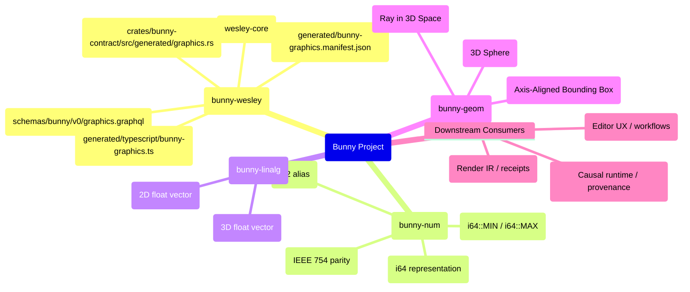
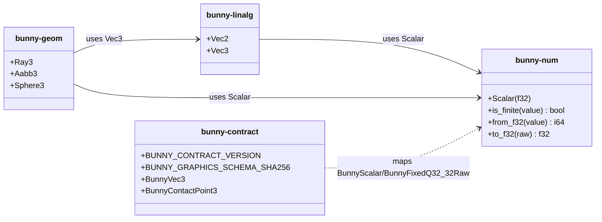
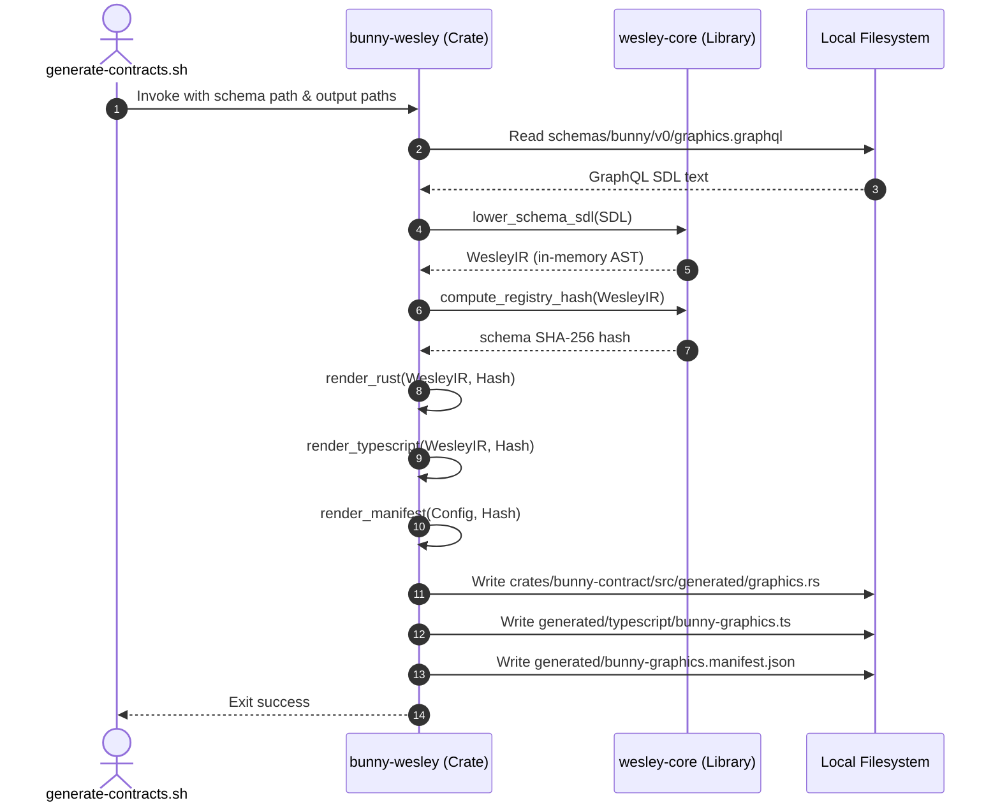

# Bunny Technical Teardown: Deterministic Math, Geometry, and Schema Contracts

## Table of Contents
| Section | Line Range |
| --- | --- |
| [1. High-Level System Mind Map](#1-high-level-system-mind-map) | L22 - L52 |
| [2. Domain Dictionary](#2-domain-dictionary) | L53 - L66 |
| [3. Architectural Core & Relationships](#3-architectural-core--relationships) | L67 - L108 |
| [4. Bootstrapping vs. Runtime Lifecycles](#4-bootstrapping-vs-runtime-lifecycles) | L109 - L127 |
| [5. Entry Point: Contract Generation Lifecycle](#5-entry-point-contract-generation-lifecycle) | L128 - L185 |
| [6. Golden Path 1: Schema Compilation & DTO Lowering](#6-golden-path-1-schema-compilation--dto-lowering) | L186 - L210 |
| [7. Anatomy of a Payload: Data Translation Layers](#7-anatomy-of-a-payload-data-translation-layers) | L211 - L284 |
| [8. Golden Path 2: Deterministic Q32.32 Fixed-Point Math](#8-golden-path-2-deterministic-q3232-fixed-point-math) | L285 - L526 |
| [9. Unhappy Paths & Error Handling](#9-unhappy-paths--error-handling) | L527 - L553 |
| [10. Concurrency, Asynchrony, and Execution Models](#10-concurrency-asynchrony-and-execution-models) | L554 - L566 |
| [11. Dependencies, Borders, and Security Boundaries](#11-dependencies-borders-and-security-boundaries) | L567 - L591 |
| [12. Configuration and Environment Tuning](#12-configuration-and-environment-tuning) | L592 - L604 |
| [13. Architectural Trade-offs & System Decisions](#13-architectural-trade-offs--system-decisions) | L605 - L618 |

---

## 1. High-Level System Mind Map



---

## 2. Domain Dictionary

| Term | Domain | Definition |
| --- | --- | --- |
| **DTO (Data Transfer Object)** | System Architecture | A stateless data representation generated to enforce schema contracts across language boundaries. |
| **Q32.32 Fixed-Point** | Numerical Math | A fixed-point representation using a signed 64-bit integer, where 32 bits represent the integer part and 32 bits represent the fractional part. |
| **Wesley Core** | Code Generation | An upstream compiler dependency (`wesley-core`) that lowers GraphQL Schema Definition Language (SDL) files into a intermediate JSON representation (IR). |
| **Wesley IR** | Code Generation | An intermediate representation of data contracts containing parsed types, fields, nullability, lists, and metadata. |
| **Ties-to-Even Rounding** | Numerical Math | An unbiased rounding strategy (also known as Banker's rounding) where numbers exactly halfway between two options are rounded to the nearest even number. |
| **Saturating Arithmetic** | Numerical Math | An overflow policy where operations exceeding maximum or minimum limits return the limit value rather than wrapping. |
| **Downstream Adapter** | System Integration | Optional crates or packages (like `bunny-echo` or `bunny-geordi`) that adapt Bunny's neutral data models into specific project architectures. |

---

## 3. Architectural Core & Relationships

Bunny acts as a **neutral Rust graphics commons** designed to provide deterministic mathematics, linear algebra, geometry primitives, and render-contract data types. It serves as the baseline graphics infrastructure shared across several downstream projects without introducing dependency cycles or product-specific leakage.



Downstream components consume Bunny according to strict architectural guidelines:
* **Echo** owns the causal runtime, strand execution, transactions, and provenance. It imports Bunny to run deterministic math operations, wrapping Bunny's raw math outputs inside causal facts.
* **Geordi** owns the authored scene IR, rendering backends, receipts, and feature negotiations. It uses Bunny for basic intersection, math, bounding box limits, and camera operations, rendering frames without learning about Echo's causal structure.
* **jedit/Jim** handles the interactive editor frontend. It consumes Bunny primitives directly for execution-critical hot paths.

---

## 4. Bootstrapping vs. Runtime Lifecycles

Bunny is structured into two distinct lifecycles:

1. **Bootstrapping Phase (Contract Compilation):**
   * This is an offline, developer-driven build step.
   * Input: The GraphQL schema file (`schemas/bunny/v0/graphics.graphql`).
   * Process: Executed by `scripts/generate-contracts.sh`, which invokes the `bunny-wesley` code generator.
   * Output: Autogenerated Rust and TypeScript DTOs, plus a verification manifest recording schema checksums.
   * Verification: The generated files are committed directly to version control. Build tasks (e.g., CI gates) compare schema SHAs to verify no drift has occurred.

2. **Runtime Phase (CPU Deterministic Math):**
   * This is the inline execution of mathematics, geometry intersections, and coordinate transformation logic on the CPU.
   * Inputs: In-memory primitive floats (`f32`) or fixed-point values (`i64`).
   * Process: Pure, side-effect-free functions (e.g., converting floats to fixed-point using bitwise IEEE 754 parsing).
   * Storage: State lives purely in memory as native primitives inside temporary CPU registers and thread stacks.

---

## 5. Entry Point: Contract Generation Lifecycle

The contract generation starts at `scripts/generate-contracts.sh`.

```bash
#!/usr/bin/env bash
set -euo pipefail

cargo run -p bunny-wesley -- \
  schemas/bunny/v0/graphics.graphql \
  --rust crates/bunny-contract/src/generated/graphics.rs \
  --typescript generated/typescript/bunny-graphics.ts \
  --manifest generated/bunny-graphics.manifest.json
```

This shell script executes the binary compiled from the `bunny-wesley` crate with the workspace's GraphQL SDL path and destination file targets.

### The Code Generator Binary (`bunny-wesley/src/main.rs`)

The `main()` function in the `bunny-wesley` generator serves as the compilation entry point:

```rust
fn main() {
    if let Err(error) = run() {
        eprintln!("bunny-wesley: {error}");
        std::process::exit(1);
    }
}
```

The underlying generation pipeline is modeled as follows:



---

## 6. Golden Path 1: Schema Compilation & DTO Lowering

When the generator is executed, it runs through the following sequence:

1. **CLI Argument Parsing:**
   The arguments are scanned inside `parse_args()`. It expects exactly one positional argument pointing to the schema file, plus the `--rust`, `--typescript`, and `--manifest` flags.
2. **Upstream SDL Lowering:**
   The GraphQL SDL contents are passed into `wesley_core::lower_schema_sdl()`. This library parses the types, objects, and scalars, returning a structured `WesleyIR` containing a list of `TypeDefinition` nodes.
3. **Integrity Hash Generation:**
   `wesley_core::compute_registry_hash()` calculates a stable SHA-256 hash representing the structural definition of the parsed schema registry. This hash acts as an API compatibility seal.
4. **Code Emission:**
   The generator loops through all parsed schema objects, selecting only definitions prefixed with `"Bunny"` (via `is_bunny_type()`).
   * **Rust Generator (`render_rust`)**: Creates Struct definitions and type aliases. Nullable fields are translated into `Option<T>`, lists are wrapped in `Vec<T>`, and custom scalars are mapped to native types:
     * `BunnyScalar` maps to `f32`
     * `BunnyFixedQ32_32Raw` maps to `i64`
   * **TypeScript Generator (`render_typescript`)**: Generates read-only interface types. Nullable fields become unions (`T | null`), lists are mapped to arrays (`T[]`), and custom scalars are mapped as follows:
     * `BunnyScalar` maps to `number`
     * `BunnyFixedQ32_32Raw` maps to `bigint`
5. **Manifest Generation:**
   Generates a JSON manifest compiling metadata such as the generator version, `wesley-core` version, input schema SHA-256, and output file paths.
6. **Atomic Disk Operations:**
   Writes the rendered buffers out to disk, automatically creating any parent directories if they do not exist.

---

## 7. Anatomy of a Payload: Data Translation Layers

This section traces a graphic contract definition (`BunnyContactPoint3`) through its multiple representations as it is parsed and compiled.

### 1. The Source: GraphQL SDL (`schemas/bunny/v0/graphics.graphql`)
```graphql
type BunnyContactPoint3 {
  point: BunnyVec3!
  normal: BunnyVec3!
  depth: BunnyScalar
}
```

### 2. The Intermediate Representation: `WesleyIR` (Conceptual JSON representation)
```json
{
  "name": "BunnyContactPoint3",
  "kind": "Object",
  "fields": [
    {
      "name": "point",
      "type": {
        "base": "BunnyVec3",
        "nullable": false,
        "is_list": false,
        "list_item_nullable": null,
        "list_wrappers": []
      }
    },
    {
      "name": "normal",
      "type": {
        "base": "BunnyVec3",
        "nullable": false,
        "is_list": false,
        "list_item_nullable": null,
        "list_wrappers": []
      }
    },
    {
      "name": "depth",
      "type": {
        "base": "BunnyScalar",
        "nullable": true,
        "is_list": false,
        "list_item_nullable": null,
        "list_wrappers": []
      }
    }
  ]
}
```

### 3. The Target: Generated Rust DTO (`crates/bunny-contract/src/generated/graphics.rs`)
```rust
#[derive(Clone, Debug, PartialEq)]
pub struct BunnyContactPoint3 {
    pub point: BunnyVec3,
    pub normal: BunnyVec3,
    pub depth: Option<BunnyScalar>,
}
```

### 4. The Target: Generated TypeScript DTO (`generated/typescript/bunny-graphics.ts`)
```typescript
export interface BunnyContactPoint3 {
  readonly point: BunnyVec3;
  readonly normal: BunnyVec3;
  readonly depth: BunnyScalar | null;
}
```

---

## 8. Golden Path 2: Deterministic Q32.32 Fixed-Point Math

Bunny guarantees CPU floating-point determinism via a custom software-defined fixed-point profile. Floating-point values (`f32`) are converted into a Q32.32 representation, which is backed by a signed 64-bit integer (`i64`):

$$\text{real\_value} = \frac{\text{raw}}{2^{32}}$$

Because fixed-point numbers have uniform spacing between representable values (exactly $2^{-32}$), they are immune to the rounding variance, floating-point hardware differences (FMA), and denormal handling inconsistencies across different architectures (x86_64 vs ARM64 vs WASM engines).

### The Math Conversion Flowcharts

#### Floats to Fixed Point (`from_f32`)

```mermaid
flowchart TD
    A["Input: f32"] --> B{Is NaN?}
    B -- Yes --> C[Return 0]
    B -- No --> D{Is Infinite?}
    D -- Yes --> E{Is Positive?}
    E -- Yes --> F["Return i64::MAX"]
    E -- No --> G["Return i64::MIN"]
    D -- No --> H[Unpack IEEE 754 Bits]
    H --> I["Extract Sign, Exponent, Mantissa"]
    I --> J{"Exponent == 0?"}
    J -- Yes --> K["Subnormal: Mantissa = mant, exp = -126
    ]
    J -- No --> L["Normal: Mantissa = 1 << 23 BITOR mant, exp = exp_u8 - 127"]
    K --> M["Calculate Shift = exp + 9"]
    L --> M
    M --> N{"Shift >= 0?"}
    N -- Yes --> O{"Shift > 103?"}
    O -- Yes --> P["Saturate to i128::MAX"]
    O -- No --> Q["abs_raw = mantissa << shift"]
    N -- No --> R["abs_raw = round_shift_right_u64"]
    R --> S["Apply Ties-to-Even rounding"]
    Q --> T[Apply Sign]
    P --> T
    S --> T
    T --> U["Saturate i128 to i64"]
    U --> V["Return i64"]
```

#### Shift and Ties-to-Even Rounding (`round_shift_right_u64`)

```mermaid
flowchart TD
    A[Input: value: u64, shift: u32] --> B{shift == 0?}
    B -- Yes --> C[Return value]
    B -- No --> D{shift >= 64?}
    D -- Yes --> E[Return 0]
    D -- No --> F[q = value >> shift]
    F --> G[mask = 2^shift - 1]
    G --> H[r = value & mask]
    H --> I[half = 2^(shift-1)]
    I --> J{r > half?}
    J -- Yes --> K[Return q + 1]
    J -- No --> L{r < half?}
    L -- Yes --> M[Return q]
    L -- No --> N{q is odd?}
    N -- Yes --> O[Return q + 1]
    N -- No --> P[Return q]
```

---

### Step-by-Step Code Walkthrough

Let's dissect `from_f32` and `to_f32` in `crates/bunny-num/src/fixed_q32_32.rs` to show exactly how it performs IEEE-754 bit unpacking and Banker's rounding.

#### 1. Converting Float to Fixed Point (`from_f32`)

```rust
pub fn from_f32(value: f32) -> i64 {
    if value.is_nan() {
        return 0;
    }
    if value.is_infinite() {
        return if value.is_sign_positive() {
            i64::MAX
        } else {
            i64::MIN
        };
    }
```
* **Rationale:** NaNs are mapped to `0` because fixed-point format does not support sentinel representation states. Infinities are saturated to the maximum and minimum boundaries of the signed 64-bit integer.

```rust
    let bits = value.to_bits();
    let sign = (bits >> 31) != 0;
    let exp_u8 = ((bits >> 23) & 0xff) as u8;
    let exp = i32::from(exp_u8);
    let mant = bits & 0x7fffff;
```
* **Rationale:** The 32-bit float bit pattern is unpacked according to IEEE 754 specifications:
  * Bit 31: Sign bit.
  * Bits 23-30: 8-bit biased exponent.
  * Bits 0-22: 23-bit mantissa (fraction).

```rust
    if exp == 0 && mant == 0 {
        return 0;
    }

    let mantissa: u64 = if exp == 0 {
        u64::from(mant)
    } else {
        u64::from((1_u32 << 23) | mant)
    };
```
* **Rationale:** If `exp == 0` and the mantissa is non-zero, the number is **subnormal**. The implicit leading 1 bit is omitted. If `exp > 0`, the number is **normal**, and the implicit leading 1 is reinserted at bit position 23.

```rust
    let unbiased = if exp == 0 { -126 } else { exp - 127 };
    let frac_i32 = FRAC_BITS as i32;
    let shift = unbiased + (frac_i32 - 23);
```
* **Rationale:** 
  * The biased exponent is converted back into its real power-of-two exponent. Normal float exponent bias is `127`. Subnormal floats are evaluated at an exponent of `-126`.
  * We calculate the scaling offset required to move the binary point to match a Q32.32 format (shifting by the target fraction size `32` and subtracting the mantissa size `23`).
  * `shift = exponent + (32 - 23) = exponent + 9`.

```rust
    let abs_raw: i128 = if shift >= 0 {
        let shift_u = shift.unsigned_abs();
        if shift_u > 103 {
            i128::MAX
        } else {
            i128::from(mantissa) << shift_u
        }
    } else {
        let rshift = shift.unsigned_abs();
        let rounded = round_shift_right_u64(mantissa, rshift);
        i128::from(rounded)
    };
```
* **Rationale:** 
  * If the exponent scaling factor is positive, the value is shifted left. A safety guard prevents shifting by more than 103 (which would overflow the 128-bit temporary container).
  * If the exponent scaling factor is negative, the value is shifted right, meaning fractional bits must be truncated. To avoid bias accumulation, the value is processed through `round_shift_right_u64()`.

```rust
    let signed_raw = if sign { -abs_raw } else { abs_raw };
    saturate_i128_to_i64(signed_raw)
}
```
* **Rationale:** The negative sign is applied if needed, and the final 128-bit integer is safely downcast into a 64-bit signed integer. If the value falls outside `[i64::MIN, i64::MAX]`, it saturates at the respective boundary.

---

#### 2. Downward Bit Shifting & Ties-to-Even Rounding

```rust
fn round_shift_right_u64(value: u64, shift: u32) -> u64 {
    if shift == 0 {
        return value;
    }
    if shift >= 64 {
        return 0;
    }

    let q = value >> shift;
    let mask = (1_u64 << shift) - 1;
    let r = value & mask;
    let half = 1_u64 << (shift - 1);

    if r > half {
        q + 1
    } else if r < half {
        q
    } else if (q & 1) == 1 {
        q + 1
    } else {
        q
    }
}
```
* **Mathematical Rationale:**
  * `q` is the integer quotient after right-shifting by `shift` bits.
  * `r` captures the remainder (bits shifted out).
  * `half` represents the exact halfway value (e.g., `0.5` in the discarded decimal workspace).
  * If the remainder `r` is larger than `half`, the quotient is rounded up (`q + 1`).
  * If the remainder `r` is smaller than `half`, the quotient is rounded down (`q`).
  * If the remainder `r` is exactly equal to `half`, **Banker's rounding (Ties-to-Even)** is applied:
    * If `q` is odd (`(q & 1) == 1`), rounding up makes it even (`q + 1`).
    * If `q` is even, it is returned unchanged (`q`).

---

#### 3. Converting Fixed Point back to Float (`to_f32`)

To reverse the conversion, Q32.32 raw bits are reconstructed into an IEEE 754 float:

```rust
pub fn to_f32(raw: i64) -> f32 {
    if raw == 0 {
        return 0.0;
    }

    let sign = raw.is_negative();
    let abs: u64 = raw.unsigned_abs();
```
* **Rationale:** The sign is recorded, and operations are run on the absolute value.

```rust
    let k = 63_u32.saturating_sub(abs.leading_zeros());
    let frac_i32 = FRAC_BITS as i32;
    let mut exp = (k as i32) - frac_i32;
```
* **Rationale:**
  * Finding the index of the highest set bit (`k`) allows us to determine the exponent: `exponent = highest_bit - 32`.
  * The absolute integer must be aligned so that the leading bit resides at position 23 (the float mantissa boundary).

```rust
    let mut sig: u128 = if k > 23 {
        let rshift = k - 23;
        round_shift_right_u128(u128::from(abs), rshift)
    } else {
        let lshift = 23 - k;
        u128::from(abs) << lshift
    };

    if sig >= (1_u128 << 24) {
        sig >>= 1;
        exp = exp.saturating_add(1);
    }
```
* **Rationale:**
  * If the highest set bit is greater than 23, we right-shift and round the significand.
  * If it is less than 23, we shift left.
  * If rounding causes the significand to overflow past the 23-bit mantissa boundary (reaching `1 << 24`), we shift it right by one bit and increment the exponent.

```rust
    let exp_field = (exp + 127) as u32;
    let mantissa = (sig & ((1_u128 << 23) - 1)) as u32;
    let bits = (u32::from(sign) << 31) | (exp_field << 23) | mantissa;
    f32::from_bits(bits)
}
```
* **Rationale:** The float's binary fields are reassembled:
  * The exponent is re-biased by adding `127`.
  * The implicit leading bit is masked off the significand.
  * The components are merged, and `f32::from_bits()` is returned.

---

## 9. Unhappy Paths & Error Handling

System safety and deterministic execution require strict behavior when edge cases occur.

### A. Generator Build-Time Failures
* **Malformed Schemas:**
  If the schema SDL contains syntactic or structural errors, `wesley_core::lower_schema_sdl()` returns a parsing error. The code generator outputs the message to `stderr` and terminates with exit code `1`, halting the downstream build pipeline.
* **Missing CLI Parameters:**
  If required arguments are omitted, the program prints the command-line usage pattern and exits.
  ```text
  usage: bunny-wesley <schema.graphql> --rust <path> --typescript <path> --manifest <path>
  ```
* **Output Path Errors:**
  If output directories are protected by system permissions or if disk space is full, the compiler will panic and return a standard filesystem `io::Error`.

### B. Math Runtime Failures
* **Floating-Point NaNs:**
  Converted to `0` inside `from_f32()`. This ensures that downstream code does not propagate poisonous, non-deterministic float state.
* **Floating-Point Infinities:**
  Saturate to the maximum integer boundaries (`i64::MAX` and `i64::MIN`).
* **Subnormal Floats:**
  Since the smallest positive value representable in Q32.32 fixed-point is $2^{-32}$ ($\approx 2.33 \times 10^{-10}$), subnormal floats (which reside down to $2^{-149}$) fall below this threshold. They automatically shift down to `0` via the ties-to-even right-shifting policy.
* **Arithmetic Overflows:**
  During float conversion, any exponent offset shifting that exceeds a 128-bit integer is bound to `i128::MAX` before final 64-bit saturation.

---

## 10. Concurrency, Asynchrony, and Execution Models

Bunny's architecture is intentionally designed around **single-threaded, synchronous execution**:

* **Why Single-Threaded?**
  Graphics math utilities must be predictable, fast, and safe to run in any execution context. Leaving concurrency policy to the caller ensures that Bunny can be embedded inside multi-threaded rendering loops, async asset loading pools, WebAssembly runtimes, or web workers without thread management overhead.
* **Absence of Sync Primitives:**
  You will not find locks (`Mutex`, `RwLock`), thread spawns, or `async/await` blocks inside Bunny's core math and geometry crates. All operations are pure, synchronous CPU pipelines.
* **Memory Safety:**
  Every data struct implements the standard `Clone`, `Copy`, `Debug`, and `PartialEq` traits. This allows the types to be sent across thread boundaries safely.

---

## 11. Dependencies, Borders, and Security Boundaries

```text
  [Downstream Apps: Echo, Geordi, jedit] (Untrusted / State-heavy)
=========================== Border ===========================
  [bunny-contract] (Generated Rust DTOs)
  [bunny-geom]     (Handwritten Geometry Primitives)
  [bunny-linalg]   (Handwritten Vectors & Matrix Primitives)
  [bunny-num]      (Handwritten Numeric Rules)
=========================== Border ===========================
  [Standard Library (core/std)] / [wesley-core] (External Dependencies)
```

### Dependency Stack
* **Standard Library:** The core crates depend only on standard library features (such as `std::path::PathBuf`, `std::fs`, and `std::env`).
* **Wesley Core:** The `bunny-wesley` generator depends on `wesley-core = "0.0.5"` to parse the GraphQL Schema.

### Security Boundary Policy
* **Zero Network/Disk Access at Runtime:**
  The runtime crates (`bunny-num`, `bunny-linalg`, `bunny-geom`, `bunny-contract`) perform zero system calls, read no environment variables, and do not access files or network sockets. This makes it impossible for external actors to inject malicious behaviors or cause memory leaks during math execution.
* **Generated DTO Boundaries:**
  The output types contain only plain public properties, with no methods or state-modification triggers.

---

## 12. Configuration and Environment Tuning

To preserve deterministic execution, Bunny avoids runtime environment variable configuration:

* **Static Crate Limits:**
  Precision settings (such as the number of fractional bits) are compiled as static constants (`FRAC_BITS = 32`). They cannot be adjusted at runtime.
* **No `cfg` Fluctuation:**
  Floating-point conversions bypass the compiler's floating-point unit (FPU) register flags and target architectures by operating on raw bit shifts (`f32::to_bits`). The conversion behavior remains identical whether compiling under `target_arch = "x86_64"` or `target_arch = "wasm32"`.
* **Generator CLI Flags:**
  The code generation tool behaves strictly according to the CLI flags passed during bootstrapping.

---

## 13. Architectural Trade-offs & System Decisions

### 1. Fixed-Point Math vs. Native Floating-Point Hardware
* **Trade-off:** We exchange raw execution speed for absolute cross-platform consistency.
* **Detail:** Modern CPUs compute native floating-point math inside highly optimized hardware FPU pipelines (sub-nanosecond latencies). In contrast, software-defined Q32.32 conversions require bitwise unpacking and division. However, hardware floating-point operations do not guarantee bit-level determinism across compilers, optimization levels, or platforms due to instruction choices (e.g., Fused Multiply-Add instructions). Software fixed-point guarantees identical bit-level results everywhere.

### 2. Static Code Generation vs. Runtime Reflection
* **Trade-off:** We accept a separate compilation step (generating DTO files) to gain compile-time type safety and runtime speed.
* **Detail:** Instead of loading GraphQL schemas dynamically at runtime and looking up fields via string hashing, Bunny generates Rust structures and TypeScript interfaces offline. This avoids parser overhead during startup and catches schema drift errors during compilation rather than at runtime.

### 3. Separation of Downstream Adapters
* **Trade-off:** We split adapter crates (`bunny-echo`, `bunny-geordi`) from core crates.
* **Detail:** This forces Bunny to remain project-neutral. It allows a developer working on the `Geordi` rendering pipeline to import `bunny-geom` without carrying the transaction execution model of the `Echo` causal engine.
