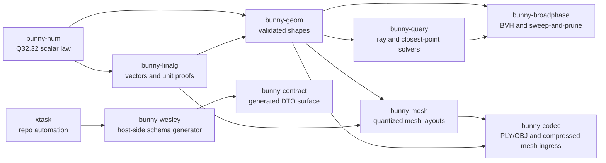

# Bunny Technical Teardown

This document is a current, compact orientation map for the Bunny workspace. It
does not replace `ROADMAP.md`, `CHANGELOG.md`, or goalpost evidence documents;
those files remain the source of truth for version history and completion
claims.

## System Shape

Bunny is a deterministic Rust graphics commons. Its crates are deliberately
small and neutral: they provide math, geometry, query, mesh, codec, and contract
primitives without importing downstream application concepts.



## Crate Roles

| Crate | Lifecycle | Responsibility |
| --- | --- | --- |
| `bunny-num` | Runtime library | Q32.32 fixed-point profile, validated float ingress, raw-value determinism |
| `bunny-linalg` | Runtime library | Fixed vectors, float DTO vectors, unit-vector invariants |
| `bunny-geom` | Runtime library | Validated rays, AABBs, spheres, and fixed/float boundary conversion |
| `bunny-query` | Runtime library | Deterministic ray intersections and closest-point queries |
| `bunny-broadphase` | Runtime library | Caller-buffered BVH and sweep-and-prune broadphase helpers |
| `bunny-mesh` | Runtime library | Quantized vertex layouts, triangle buffers, mesh hash framing |
| `bunny-codec` | Runtime library | Zero-copy PLY/OBJ parsers and Bunny compressed mesh decoder |
| `bunny-contract` | Runtime library | Generated Rust DTOs and schema/generator witness constants |
| `bunny-wesley` | Host tooling | GraphQL SDL lowering and Rust/TypeScript/manifest emission |
| `xtask` | Host tooling | Contract generation and Code Dojo repository gates |

Runtime library crates are expected to compile for native targets and
`wasm32-unknown-unknown`. Host tooling crates are covered by native tests and
are intentionally not WASM library crates.

## Contract Generation

Bunny owns its schema at `schemas/bunny/v0/graphics.graphql`. Regenerate the
checked-in Rust DTOs, TypeScript DTOs, and manifest from the workspace root:

```bash
cargo run --locked -p xtask -- generate
```

The generated witnesses are:

| Output | Path |
| --- | --- |
| Rust DTOs | `crates/bunny-contract/src/generated/graphics.rs` |
| TypeScript DTOs | `generated/typescript/bunny-graphics.ts` |
| Manifest | `generated/bunny-graphics.manifest.json` |

The generator records:

* authored schema SHA-256;
* `bunny-wesley/<version>` generator identifier;
* `wesley-core` version;
* generated output paths.

## Runtime Data Flow

1. Boundary APIs accept finite float DTOs or already-fixed values.
2. Float ingress validates non-finite and out-of-range values before Q32.32
   conversion.
3. Fixed-point primitives carry the canonical deterministic values.
4. Geometry/query/broadphase/codecs return explicit errors or `Option` values
   for invalid caller input instead of panicking; mesh exposes boolean layout
   validation and deterministic hash framing.
5. Downstream projects may wrap Bunny values in their own provenance, render, or
   UI concepts; Bunny does not depend on those concepts.

## Quality Gates

The local and CI gate is Code Dojo:

```bash
cargo run --locked -p xtask -- code-dojo --all
```

Release candidates also run the archive verification gate with the intended tag:

```bash
RELEASE_TAG=v0.5.0 scripts/publish-crates.sh verify
```

The current gate covers formatting, Clippy, strict library panic/indexing
policy, cargo-deny dependency policy, deterministic receipt checks, native
workspace tests, and WASM checks for every WASM-compatible library crate.

## Boundaries

Bunny owns portable deterministic graphics primitives. It does not own:

* Echo transaction strands, causal facts, or provenance authority;
* Geordi render backends, GPU receipts, feature negotiation, or rasterization;
* jedit editor workflows, DOM state, UI layout policy, or product behavior;
* Unity runtime state, browser compatibility quirks, or app lifecycle policy.

Future matrices, transforms, quaternions, collision, visibility, optics, SIMD,
fixtures, and adapter work is tracked in `ROADMAP.md` and
`docs/MATH_GEOMETRY_CAPABILITY_MAP.md`.
