# Bunny Technical Teardown

This document is a zero-to-hero guide to Bunny. It starts at the real execution
entry points, follows the successful paths through the system, then opens each
package and explains what it owns, how data moves through it, where errors are
returned, and why the architecture is shaped this way.

Bunny is a Rust workspace for deterministic graphics-adjacent primitives. It is
not an application server. It has no database, no request router, no user
accounts, and no runtime authentication flow. Its core job is to provide
portable math, geometry, mesh, codec, contract, and validation components that
downstream projects can trust across native and WebAssembly targets.

## Domain Dictionary

These terms appear throughout the workspace.

| Term | Meaning |
| --- | --- |
| Determinism | The same logical input should produce the same observable output across supported platforms. Bunny avoids depending on host floating-point behavior for canonical math. |
| Q32.32 | A signed fixed-point format stored in `i64`. The upper 32 bits carry the integer part and the lower 32 bits carry the fractional part. One real unit is `1_i64 << 32`. |
| Fixed value | A value already converted into the canonical deterministic Q32.32 representation. |
| Float boundary | A deliberate ingress or egress boundary where Bunny accepts or returns `f32` for interoperability. These boundaries are validated or explicitly marked. |
| DTO | Data transfer object generated from Bunny's GraphQL schema. DTOs describe contract shapes; they are not the same thing as validated runtime geometry. |
| Zero-copy parser | A parser that borrows input bytes or text and returns views into the original input instead of allocating transformed buffers. |
| Borrowed view | A struct that stores references to validated input data. The input remains the source of truth for payload bytes. |
| Golden vector | A deterministic expected-output fixture, usually stored as raw integer values or exact bytes. |
| Code Dojo | The repository quality gate implemented in `xtask`. It combines AST policy checks, formatting, Clippy, dependency policy, tests, deterministic receipts, and WASM checks. |
| Goalpost | A planning milestone grouping several slices of work. Goalposts live in docs and GitHub Issues. |
| Slice | A small executable unit under a goalpost. |

## Workspace At A Glance

The workspace has ten packages. Eight are public runtime or contract crates,
one is a schema generator, and one is repository automation.

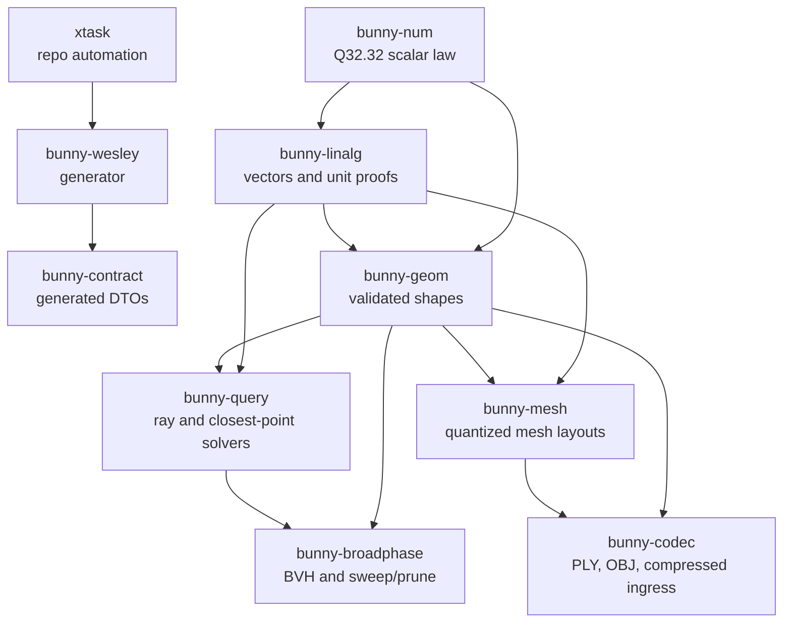
```mermaid
flowchart TD
    xtask["xtask\nrepo automation"]
    wesley["bunny-wesley\ngenerator"]
    contract["bunny-contract\ngenerated DTOs"]
    num["bunny-num\nQ32.32 scalar law"]
    linalg["bunny-linalg\nvectors and unit proofs"]
    geom["bunny-geom\nvalidated shapes"]
    query["bunny-query\nray and closest-point solvers"]
    mesh["bunny-mesh\nquantized mesh layouts"]
    codec["bunny-codec\nPLY, OBJ, compressed ingress"]
    broadphase["bunny-broadphase\nBVH and sweep/prune"]

    xtask --> wesley
    wesley --> contract
    num --> linalg
    linalg --> geom
    num --> geom
    geom --> query
    linalg --> query
    geom --> mesh
    linalg --> mesh
    mesh --> codec
    geom --> codec
    query --> broadphase
    geom --> broadphase
```

## Source Of Truth

Bunny has no mutable runtime database. Source of truth depends on the stage.

| Stage | Source of truth |
| --- | --- |
| Authored contracts | `schemas/bunny/v0/graphics.graphql` |
| Generated Rust DTOs | `crates/bunny-contract/src/generated/graphics.rs` |
| Generated TypeScript DTOs | `generated/typescript/bunny-graphics.ts` |
| Generator witness | `generated/bunny-graphics.manifest.json` and generated constants |
| Runtime math and geometry behavior | Rust source under `crates/*/src` plus tests |
| Deterministic evidence | `tests/determinism.rs`, raw-output tests, fixture bytes, and goalpost docs |
| Planning | GitHub Issues and milestones, with `ROADMAP.md` as a durable narrative map |
| Release state | Git tags, GitHub Releases, release workflow runs, and crates.io package versions |

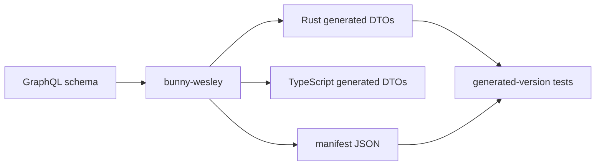
```mermaid
flowchart LR
    schema["GraphQL schema"]
    generator["bunny-wesley"]
    rust["Rust generated DTOs"]
    ts["TypeScript generated DTOs"]
    manifest["manifest JSON"]
    tests["generated-version tests"]

    schema --> generator
    generator --> rust
    generator --> ts
    generator --> manifest
    rust --> tests
    manifest --> tests
```

## Bootstrapping Versus Runtime

The workspace separates setup-time tooling from runtime library code.

| Phase | What runs | Purpose |
| --- | --- | --- |
| Bootstrapping | `cargo run --locked -p xtask -- generate` | Regenerate DTOs from the schema. |
| Local quality gate | `cargo run --locked -p xtask -- code-dojo --all` | Prove the repo meets local standards before push or PR. |
| Runtime use | Library APIs such as `FixedQ32_32::try_from_f32`, `FixedRay3::try_new`, `decode_compressed_mesh`, or `build_bvh` | Let downstream code do deterministic math, geometry, codec, or broadphase work. |
| Release verification | `RELEASE_TAG=vX.Y.Z scripts/publish-crates.sh verify` | Verify package archive readiness before publication. |
| Publication | GitHub Release workflow | Publish crates in dependency order to crates.io. |

The most important architectural boundary is this: `xtask` and `bunny-wesley`
are host-side tools; the library crates are the runtime surface and must remain
portable to WebAssembly where appropriate.

## Entry Point: `xtask/src/main.rs`

The first execution point most contributors hit is:

```rust
fn main() {
    if let Err(err) = run() {
        eprintln!("xtask error: {err}");
        std::process::exit(1);
    }
}
```

This is intentionally plain. `main` does not own business logic. It turns a
`Result` into a process exit code, which gives Git hooks and CI a reliable
success/failure signal.

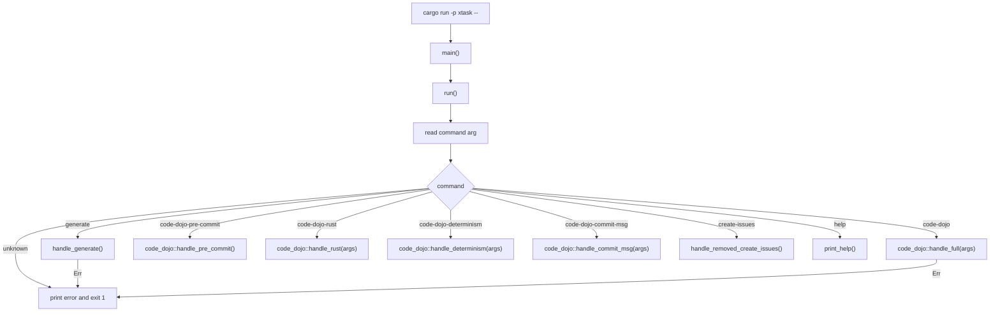
```mermaid
flowchart TD
    start["cargo run -p xtask -- <command>"]
    main["main()"]
    run["run()"]
    args["read command arg"]
    dispatch{"command"}
    generate["handle_generate()"]
    dojo["code_dojo::handle_full(args)"]
    precommit["code_dojo::handle_pre_commit()"]
    rust["code_dojo::handle_rust(args)"]
    det["code_dojo::handle_determinism(args)"]
    msg["code_dojo::handle_commit_msg(args)"]
    removed["handle_removed_create_issues()"]
    help["print_help()"]
    fail["print error and exit 1"]

    start --> main --> run --> args --> dispatch
    dispatch -->|generate| generate
    dispatch -->|code-dojo| dojo
    dispatch -->|code-dojo-pre-commit| precommit
    dispatch -->|code-dojo-rust| rust
    dispatch -->|code-dojo-determinism| det
    dispatch -->|code-dojo-commit-msg| msg
    dispatch -->|create-issues| removed
    dispatch -->|help| help
    dispatch -->|unknown| fail
    generate -->|Err| fail
    dojo -->|Err| fail
```

### Why The Removed `create-issues` Command Matters

`create-issues` now fails closed. That is a deliberate source-of-truth choice:
GitHub Issues are canonical backlog state, so a local command must not recreate
or mutate tracker items from stale roadmap literals.

Trade-off: this removes a convenient bootstrap mechanism, but it prevents the
repo from reintroducing duplicate or stale planning tickets.

## Golden Path 1: Contributor Runs Code Dojo

The most common operational path is:

```bash
cargo run --locked -p xtask -- code-dojo --all
```

The command must include `--all`. That avoids half-gates becoming accepted
release evidence.

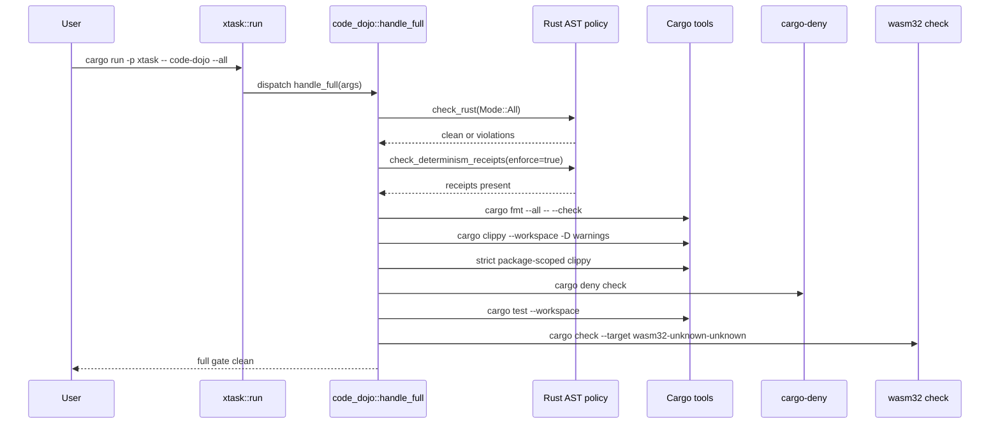
```mermaid
sequenceDiagram
    participant User
    participant Xtask as xtask::run
    participant Dojo as code_dojo::handle_full
    participant AST as Rust AST policy
    participant Cargo as Cargo tools
    participant Deny as cargo-deny
    participant WASM as wasm32 check

    User->>Xtask: cargo run -p xtask -- code-dojo --all
    Xtask->>Dojo: dispatch handle_full(args)
    Dojo->>AST: check_rust(Mode::All)
    AST-->>Dojo: clean or violations
    Dojo->>AST: check_determinism_receipts(enforce=true)
    AST-->>Dojo: receipts present
    Dojo->>Cargo: cargo fmt --all -- --check
    Dojo->>Cargo: cargo clippy --workspace -D warnings
    Dojo->>Cargo: strict package-scoped clippy
    Dojo->>Deny: cargo deny check
    Dojo->>Cargo: cargo test --workspace
    Dojo->>WASM: cargo check --target wasm32-unknown-unknown
    Dojo-->>User: full gate clean
```

### What Code Dojo Checks

Code Dojo is not just a script wrapper. It parses Rust source with `syn` and
applies category-specific policy.

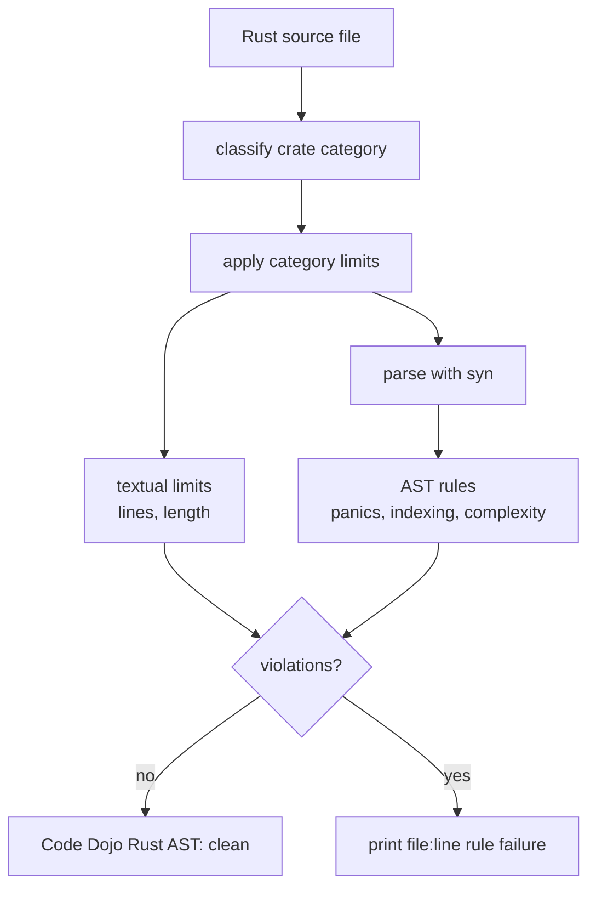
```mermaid
flowchart TD
    source["Rust source file"]
    classify["classify crate category"]
    limits["apply category limits"]
    ast["parse with syn"]
    text["textual limits\nlines, length"]
    rules["AST rules\npanics, indexing, complexity"]
    violations{"violations?"}
    clean["Code Dojo Rust AST: clean"]
    fail["print file:line rule failure"]

    source --> classify --> limits
    limits --> text
    limits --> ast --> rules
    text --> violations
    rules --> violations
    violations -->|no| clean
    violations -->|yes| fail
```

Core crates have stricter limits than tooling. That is an explicit trade-off:
runtime libraries should be small, predictable, and panic-averse; tooling can be
larger because it does not ship into downstream runtime targets.

### Data Source Of Truth During Code Dojo

Code Dojo reads from the working tree or Git index depending on mode.

| Mode | Source of truth |
| --- | --- |
| `--all` | Nonignored tracked and untracked Rust files in the repo |
| pre-commit | Staged Rust sources from the Git index |
| commit message | The commit message file passed by Git |
| determinism receipts | Test files under each core crate's `tests/` directory |

### Unhappy Paths

Code Dojo fails fast and returns nonzero when:

| Failure | Example result |
| --- | --- |
| Missing `--all` | `code-dojo requires --all` |
| AST policy violation | Prints `path:line: [rule] message` |
| Missing determinism receipt | Core crate lacks golden-vector or deterministic tests |
| Cargo command failure | The failed command is printed |
| Commit message violation | Subject shape, length, vague wording, or AI receipt rule fails |

There is no background worker or async queue. Completion is tracked by process
exit status.

## Golden Path 2: Regenerate Contracts

The generation command is:

```bash
cargo run --locked -p xtask -- generate
```

`xtask` delegates to `bunny-wesley` with explicit input and output paths.

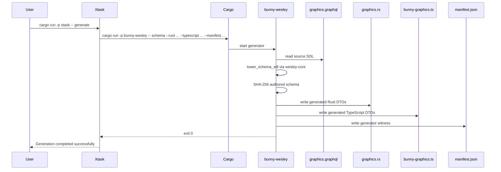
```mermaid
sequenceDiagram
    participant User
    participant Xtask
    participant Cargo
    participant Wesley as bunny-wesley
    participant Schema as graphics.graphql
    participant RustOut as graphics.rs
    participant TsOut as bunny-graphics.ts
    participant Manifest as manifest.json

    User->>Xtask: cargo run -p xtask -- generate
    Xtask->>Cargo: cargo run -p bunny-wesley -- schema --rust ... --typescript ... --manifest ...
    Cargo->>Wesley: start generator
    Wesley->>Schema: read source SDL
    Wesley->>Wesley: lower_schema_sdl via wesley-core
    Wesley->>Wesley: SHA-256 authored schema
    Wesley->>RustOut: write generated Rust DTOs
    Wesley->>TsOut: write generated TypeScript DTOs
    Wesley->>Manifest: write generator witness
    Wesley-->>Xtask: exit 0
    Xtask-->>User: Generation completed successfully
```

### Anatomy Of The Schema Payload

The authored schema defines primitive graphics DTOs:

```graphql
scalar BunnyScalar
  @bunnyScalarProfile(name: "f32")

scalar BunnyFixedQ32_32Raw
  @bunnyScalarProfile(name: "q32.32")

type BunnyVec3 {
  x: BunnyScalar!
  y: BunnyScalar!
  z: BunnyScalar!
}

type BunnyRay3 {
  origin: BunnyVec3!
  direction: BunnyVec3!
}
```

The generated manifest records the exact generator identity and schema hash:

```json
{
  "generator": "bunny-wesley/0.5.0",
  "wesleyCore": "0.0.5",
  "schema": "schemas/bunny/v0/graphics.graphql",
  "schemaSha256": "71757e5b3bbd32a99936db03080f4a896265fdd03af201b3488ba80743941c92",
  "outputs": [
    "crates/bunny-contract/src/generated/graphics.rs",
    "generated/typescript/bunny-graphics.ts"
  ]
}
```

### Why Generated DTOs Are Not Runtime Geometry

Generated DTOs are contract shapes. They carry fields such as `BunnyVec3 { x,
y, z }`, but they do not prove that a ray direction is normalized, a sphere
radius is nonnegative, or an AABB has ordered bounds. Runtime crates perform
those validations.

Trade-off: generated DTOs stay simple and language-neutral; runtime invariants
live in Rust types that can return explicit errors.

## Golden Path 3: Float Boundary To Deterministic Ray Query

The runtime golden path begins with untrusted or external `f32` values and ends
with deterministic fixed-point query output.

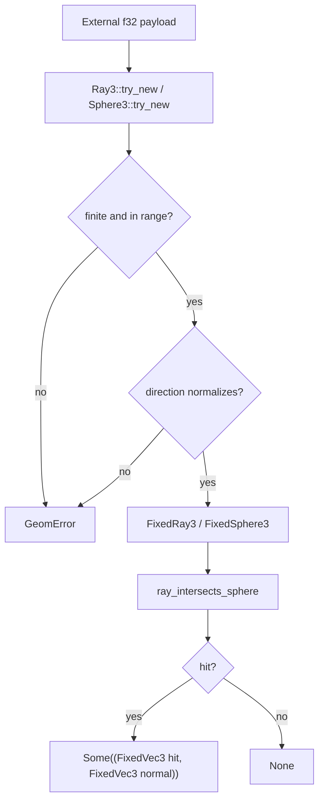
```mermaid
flowchart TD
    dto["External f32 payload"]
    geomFloat["Ray3::try_new / Sphere3::try_new"]
    finite{"finite and in range?"}
    fixed["FixedRay3 / FixedSphere3"]
    normalize{"direction normalizes?"}
    query["ray_intersects_sphere"]
    result{"hit?"}
    hit["Some((FixedVec3 hit, FixedVec3 normal))"]
    miss["None"]
    err["GeomError"]

    dto --> geomFloat
    geomFloat --> finite
    finite -->|no| err
    finite -->|yes| normalize
    normalize -->|no| err
    normalize -->|yes| fixed
    fixed --> query --> result
    result -->|yes| hit
    result -->|no| miss
```

### Anatomy Of The Runtime Payload

At the boundary, the payload is human-friendly and interoperable:

```rust
Ray3 {
    origin: Vec3::new(0.0, 0.0, -5.0),
    direction: Vec3::new(0.0, 0.0, 1.0),
}
```

Inside Bunny's deterministic core, the same concept is represented as fixed
values:

```rust
FixedRay3 {
    origin: FixedVec3 {
        x: FixedQ32_32::from_raw(0),
        y: FixedQ32_32::from_raw(0),
        z: FixedQ32_32::from_raw(-5 * (1_i64 << 32)),
    },
    direction: FixedUnitVec3::UNIT_Z,
}
```

The source of truth after conversion is the raw `i64` inside `FixedQ32_32`, not
the original float.

## Golden Path 4: Decode A Compressed Mesh

`bunny-codec` accepts a canonical compressed byte stream and returns a borrowed
view over validated sections.

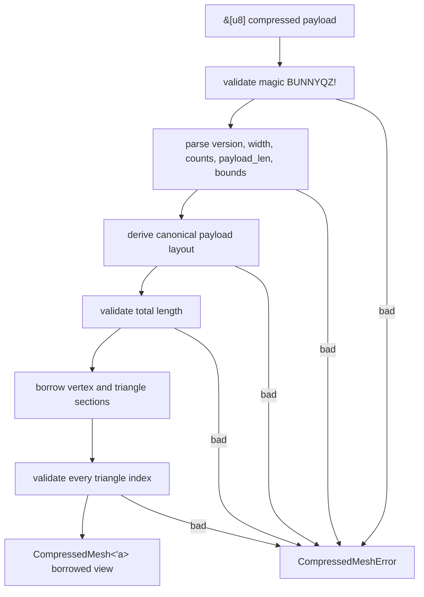
```mermaid
flowchart TD
    bytes["&[u8] compressed payload"]
    magic["validate magic BUNNYQZ!"]
    header["parse version, width, counts, payload_len, bounds"]
    layout["derive canonical payload layout"]
    len["validate total length"]
    sections["borrow vertex and triangle sections"]
    triangles["validate every triangle index"]
    view["CompressedMesh<'a> borrowed view"]
    err["CompressedMeshError"]

    bytes --> magic --> header --> layout --> len --> sections --> triangles --> view
    magic -->|bad| err
    header -->|bad| err
    layout -->|bad| err
    len -->|bad| err
    triangles -->|bad| err
```

### Anatomy Of The Compressed Payload

The decoder profile is byte-exact:

| Byte range | Field |
| --- | --- |
| `0..8` | Magic bytes `BUNNYQZ!` |
| `8` | Version, currently `1` |
| `9` | Index width, `16` or `32` |
| `10..12` | Reserved flags, must be zero |
| `12..16` | Vertex count as little-endian `u32` |
| `16..20` | Triangle count as little-endian `u32` |
| `20..28` | Payload length as little-endian `u64` |
| `28..76` | Six Q32.32 bound coordinates, each little-endian `i64` |
| `76..` | Vertex records, then triangle records |

The view returned by `decode_compressed_mesh` stores borrowed sections:

```rust
CompressedMesh<'a> {
    bounds: FixedAabb3,
    vertex_bytes: &'a [u8],
    triangle_bytes: &'a [u8],
    vertex_count: usize,
    triangle_count: usize,
    index_width: CompressedIndexWidth,
}
```

Trade-off: accessors decode individual records on demand instead of allocating
a transformed mesh. That keeps accepted-path allocation at zero, but random
access still performs bounds checks and little-endian reads.

## Golden Path 5: Build And Traverse A BVH

`bunny-broadphase` is intentionally buffer-driven. The caller owns storage.

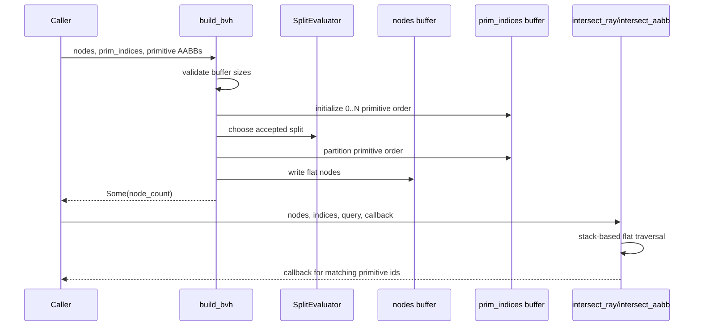
```mermaid
sequenceDiagram
    participant Caller
    participant BVH as build_bvh
    participant Split as SplitEvaluator
    participant Nodes as nodes buffer
    participant Indices as prim_indices buffer
    participant Traverse as intersect_ray/intersect_aabb

    Caller->>BVH: nodes, prim_indices, primitive AABBs
    BVH->>BVH: validate buffer sizes
    BVH->>Indices: initialize 0..N primitive order
    BVH->>Split: choose accepted split
    BVH->>Indices: partition primitive order
    BVH->>Nodes: write flat nodes
    BVH-->>Caller: Some(node_count)
    Caller->>Traverse: nodes, indices, query, callback
    Traverse->>Traverse: stack-based flat traversal
    Traverse-->>Caller: callback for matching primitive ids
```

### Source Of Truth During BVH Work

| Data | Owner |
| --- | --- |
| Primitive AABBs | Caller-provided immutable slice |
| Node storage | Caller-provided mutable `&mut [BvhNode]` |
| Primitive ordering | Caller-provided mutable `&mut [u32]` |
| Build result | Returned node count |
| Query matches | Callback invocations |

No heap allocation is required for the build or traversal path once buffers are
provided.

## Package-By-Package Deep Dive

### `xtask`: Repository Automation

`xtask` is the operational control plane. It is not a runtime dependency of the
library crates.

| Responsibility | Detail |
| --- | --- |
| Entry point | `xtask/src/main.rs::main` |
| Commands | `generate`, `code-dojo`, `code-dojo-pre-commit`, `code-dojo-rust`, `code-dojo-determinism`, `code-dojo-commit-msg` |
| External tools | `cargo`, `rustup`, `cargo-deny`, Git, Rust parser crates |
| State | File system, Git index, process exit codes |

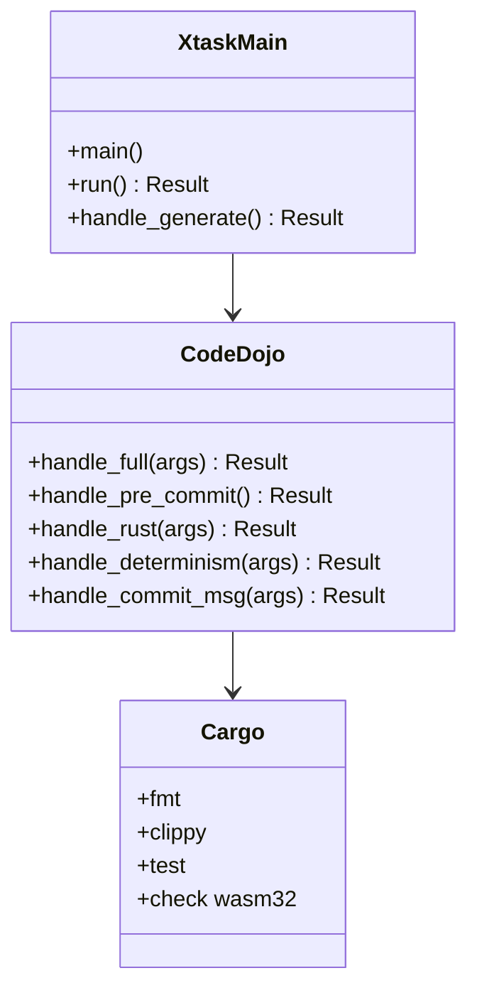
```mermaid
classDiagram
    class XtaskMain {
        +main()
        +run() Result
        +handle_generate() Result
    }
    class CodeDojo {
        +handle_full(args) Result
        +handle_pre_commit() Result
        +handle_rust(args) Result
        +handle_determinism(args) Result
        +handle_commit_msg(args) Result
    }
    class Cargo {
        +fmt
        +clippy
        +test
        +check wasm32
    }
    XtaskMain --> CodeDojo
    CodeDojo --> Cargo
```

The clever part is the AST-backed policy layer. Regex checks are brittle for
Rust. Code Dojo parses Rust with `syn`, categorizes files, and then applies
structural rules to functions, expressions, macros, indexing, panics, and
complexity.

Unhappy paths are ordinary process failures. This is exactly what local hooks
and CI want: no hidden state, no daemon, no retry queue.

### `bunny-wesley`: Schema Extension And DTO Generator

`bunny-wesley` is a binary package. Its entry point is:

```rust
fn main() {
    if let Err(error) = run() {
        eprintln!("bunny-wesley: {error}");
        std::process::exit(1);
    }
}
```

`run` parses CLI args, reads schema SDL, asks `wesley-core` to lower that schema
into IR, computes a SHA-256 hash of the authored schema, and renders Rust,
TypeScript, and a manifest.

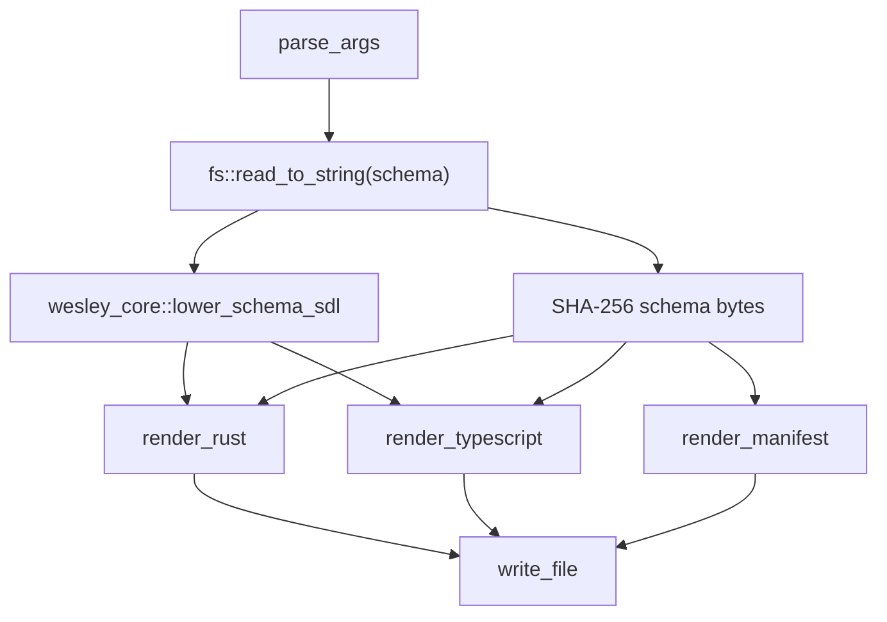
```mermaid
flowchart TD
    args["parse_args"]
    schema["fs::read_to_string(schema)"]
    ir["wesley_core::lower_schema_sdl"]
    hash["SHA-256 schema bytes"]
    renderRust["render_rust"]
    renderTs["render_typescript"]
    manifest["render_manifest"]
    write["write_file"]

    args --> schema --> ir
    schema --> hash
    ir --> renderRust --> write
    ir --> renderTs --> write
    hash --> renderRust
    hash --> renderTs
    hash --> manifest --> write
```

Scalar profiles are registry-driven:

| Schema profile | Rust type | TypeScript type |
| --- | --- | --- |
| `f32` | `f32` | `number` |
| `q32.32` | `i64` | `bigint` |

Trade-off: the generator is deliberately small and strict. It only renders Bunny
types and rejects custom scalars without a profile. That makes the generator
less general-purpose, but more predictable.

### `bunny-contract`: Generated Contract Surface

`bunny-contract` publishes generated DTOs and schema witness constants.

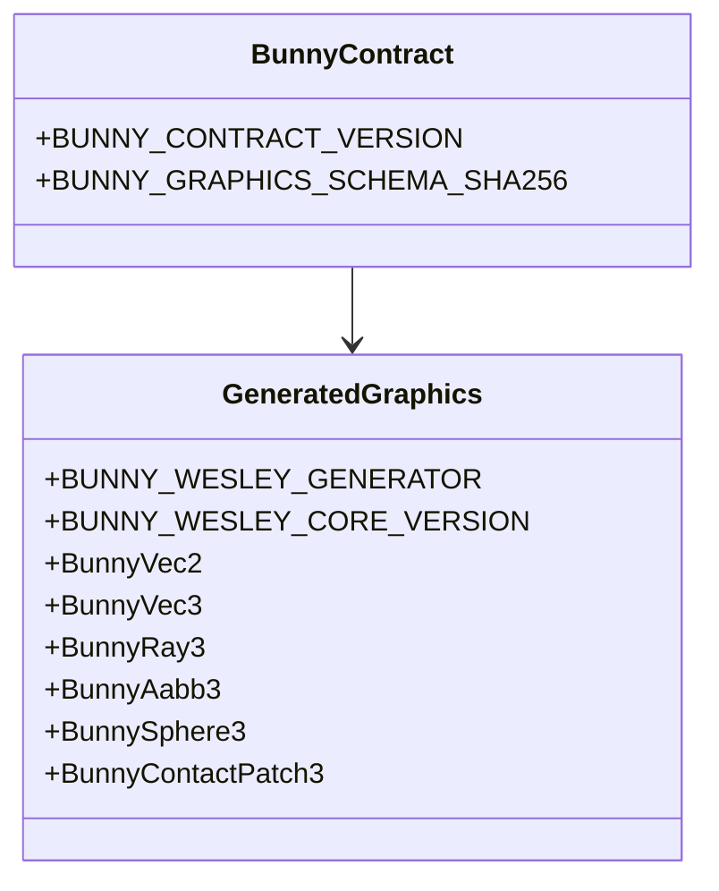
```mermaid
classDiagram
    class BunnyContract {
        +BUNNY_CONTRACT_VERSION
        +BUNNY_GRAPHICS_SCHEMA_SHA256
    }
    class GeneratedGraphics {
        +BUNNY_WESLEY_GENERATOR
        +BUNNY_WESLEY_CORE_VERSION
        +BunnyVec2
        +BunnyVec3
        +BunnyRay3
        +BunnyAabb3
        +BunnySphere3
        +BunnyContactPatch3
    }
    BunnyContract --> GeneratedGraphics
```

The generated structs are plain public data:

```rust
pub struct BunnyVec3 {
    pub x: BunnyScalar,
    pub y: BunnyScalar,
    pub z: BunnyScalar,
}
```

This package intentionally does not validate geometry. It publishes shared
contract shapes and generation evidence. Runtime packages decide whether a DTO
payload is acceptable for deterministic use.

### `bunny-num`: Deterministic Scalar Law

`bunny-num` is the bottom of the runtime stack. Everything deterministic rests
on `FixedQ32_32`.

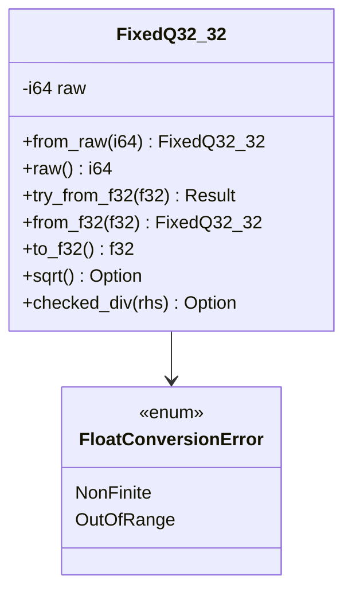
```mermaid
classDiagram
    class FixedQ32_32 {
        -i64 raw
        +from_raw(i64) FixedQ32_32
        +raw() i64
        +try_from_f32(f32) Result
        +from_f32(f32) FixedQ32_32
        +to_f32() f32
        +sqrt() Option
        +checked_div(rhs) Option
    }
    class FloatConversionError {
        <<enum>>
        NonFinite
        OutOfRange
    }
    FixedQ32_32 --> FloatConversionError
```

The raw formula is:

```text
real_value = raw / 2^32
1.0        = 4294967296 raw
```

#### Novel Design Highlight: Deterministic Float Ingress

`from_f32` is a saturating convenience path. `try_from_f32` is the validating
boundary path. The latter rejects non-finite values and finite values outside
the Q32.32 range.

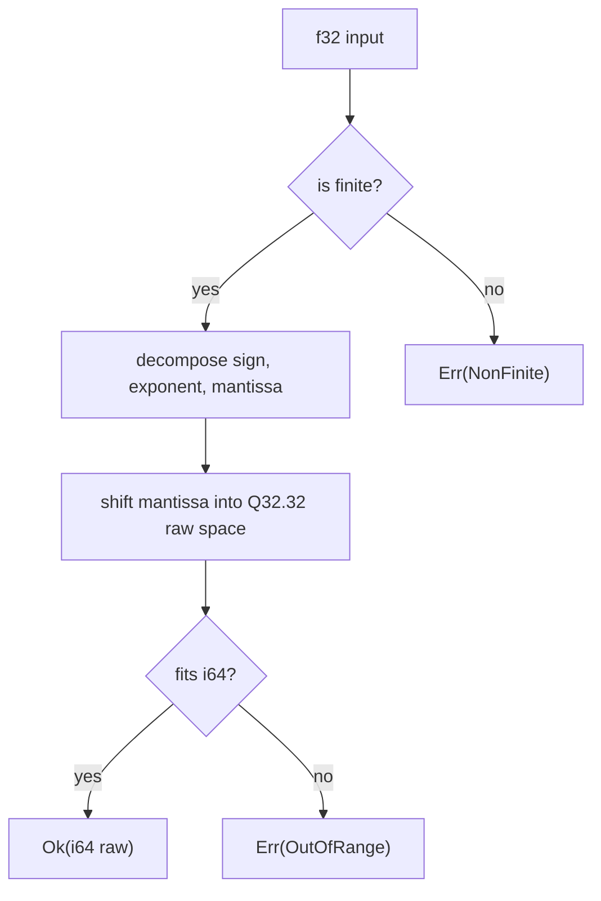
```mermaid
flowchart TD
    f["f32 input"]
    finite{"is finite?"}
    decompose["decompose sign, exponent, mantissa"]
    shift["shift mantissa into Q32.32 raw space"]
    range{"fits i64?"}
    ok["Ok(i64 raw)"]
    nonfinite["Err(NonFinite)"]
    oor["Err(OutOfRange)"]

    f --> finite
    finite -->|no| nonfinite
    finite -->|yes| decompose --> shift --> range
    range -->|yes| ok
    range -->|no| oor
```

The important detail is that conversion does not just multiply using ambient
floating-point behavior. It inspects `f32` bits, derives the mantissa shift, and
rounds deterministically.

#### Arithmetic Trade-Offs

| Operation | Choice | Trade-off |
| --- | --- | --- |
| Add/subtract | Promote to `i128`, saturate to `i64` | Prevents overflow panics but can clamp extreme values. |
| Multiply | Wide product, round right shift | Stable fixed-point product with deterministic rounding. |
| Divide | `checked_div` for explicit failure, `/` saturates | APIs can choose strict or convenience behavior. |
| Square root | Integer square-root over shifted value | Avoids platform float sqrt drift. |

### `bunny-linalg`: Vectors And Unit Proofs

`bunny-linalg` builds on `bunny-num`.

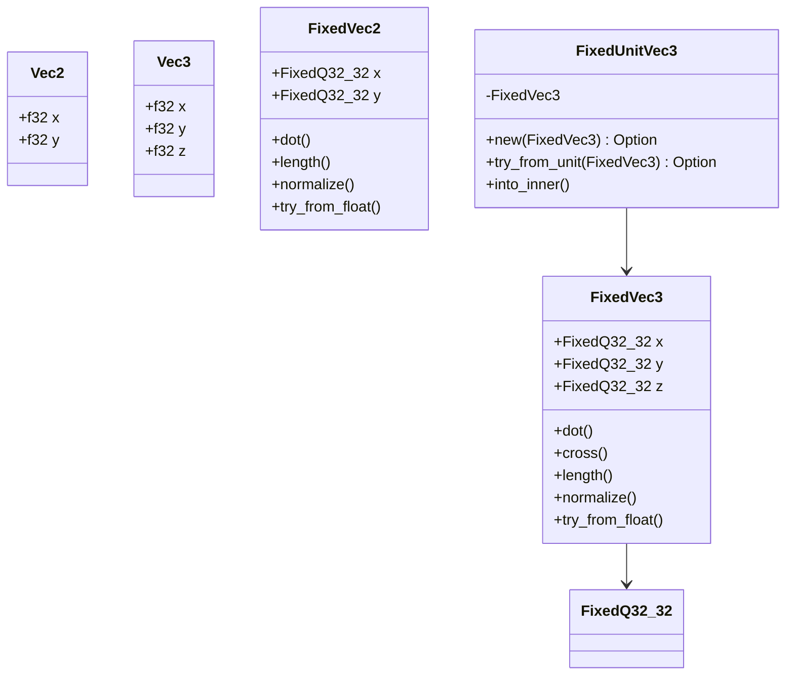
```mermaid
classDiagram
    class Vec2 {
        +f32 x
        +f32 y
    }
    class Vec3 {
        +f32 x
        +f32 y
        +f32 z
    }
    class FixedVec2 {
        +FixedQ32_32 x
        +FixedQ32_32 y
        +dot()
        +length()
        +normalize()
        +try_from_float()
    }
    class FixedVec3 {
        +FixedQ32_32 x
        +FixedQ32_32 y
        +FixedQ32_32 z
        +dot()
        +cross()
        +length()
        +normalize()
        +try_from_float()
    }
    class FixedUnitVec3 {
        -FixedVec3
        +new(FixedVec3) Option
        +try_from_unit(FixedVec3) Option
        +into_inner()
    }
    FixedVec3 --> FixedQ32_32
    FixedUnitVec3 --> FixedVec3
```

The package exposes two layers:

| Layer | Purpose |
| --- | --- |
| `Vec2` and `Vec3` | Float boundary data for interoperability. |
| `FixedVec2`, `FixedVec3`, `FixedUnitVec2`, `FixedUnitVec3` | Canonical deterministic runtime data. |

Unit vector wrappers are important because rays should not have arbitrary
directions. `FixedUnitVec3::new` normalizes a vector and proves the normalized
length. `try_from_unit` exists for compile-time known vectors where the caller
already has normalized raw values.

### `bunny-geom`: Validated Shape Boundaries

`bunny-geom` turns vector math into shape types.

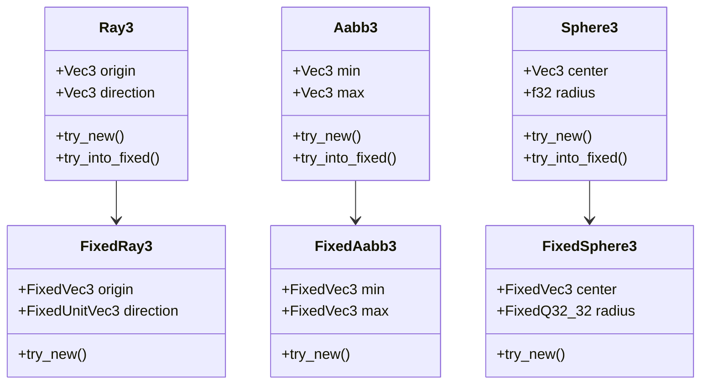
```mermaid
classDiagram
    class Ray3 {
        +Vec3 origin
        +Vec3 direction
        +try_new()
        +try_into_fixed()
    }
    class Aabb3 {
        +Vec3 min
        +Vec3 max
        +try_new()
        +try_into_fixed()
    }
    class Sphere3 {
        +Vec3 center
        +f32 radius
        +try_new()
        +try_into_fixed()
    }
    class FixedRay3 {
        +FixedVec3 origin
        +FixedUnitVec3 direction
        +try_new()
    }
    class FixedAabb3 {
        +FixedVec3 min
        +FixedVec3 max
        +try_new()
    }
    class FixedSphere3 {
        +FixedVec3 center
        +FixedQ32_32 radius
        +try_new()
    }
    Ray3 --> FixedRay3
    Aabb3 --> FixedAabb3
    Sphere3 --> FixedSphere3
```

#### Error Model

`GeomError` is the package's public error language:

| Error | Meaning |
| --- | --- |
| `InvalidAabbBounds` | A minimum component exceeds its matching maximum. |
| `NonFiniteCoordinate` | A coordinate is `NaN` or infinite. |
| `NegativeSphereRadius` | Radius is below zero. |
| `NonFiniteRadius` | Radius is `NaN` or infinite. |
| `InvalidRayDirection` | Direction is zero length or cannot become a fixed unit vector. |
| `FixedValueOutOfRange` | A finite boundary value cannot fit Q32.32. |

The key design decision is that float constructors validate not just geometric
rules but also future fixed-point representability. If `Ray3::try_new` succeeds,
`try_into_fixed` is intended to remain a valid path rather than discovering a
surprise range error later.

### `bunny-query`: Deterministic Intersection And Closest-Point Solvers

`bunny-query` assumes callers already hold validated fixed geometry.

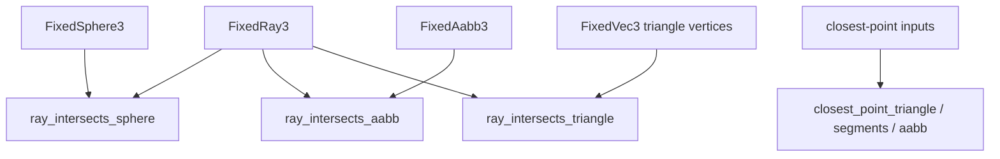
```mermaid
flowchart TD
    ray["FixedRay3"]
    sphere["FixedSphere3"]
    aabb["FixedAabb3"]
    tri["FixedVec3 triangle vertices"]
    closest["closest-point inputs"]
    raySphere["ray_intersects_sphere"]
    rayAabb["ray_intersects_aabb"]
    rayTri["ray_intersects_triangle"]
    cp["closest_point_triangle / segments / aabb"]

    ray --> raySphere
    sphere --> raySphere
    ray --> rayAabb
    aabb --> rayAabb
    ray --> rayTri
    tri --> rayTri
    closest --> cp
```

#### Ray-Sphere

The ray-sphere path projects the sphere center onto the ray direction, computes
the squared distance to the ray, compares that with the squared radius, and
then chooses the nearest nonnegative hit distance.

Unhappy path: no hit, negative-only hit, failed square root, or failed normal
normalization returns `None`.

#### Ray-AABB

The ray-AABB path uses a slab interval per axis. Parallel axes are accepted only
when the origin lies inside that axis range. Nonparallel axes narrow an
enter/exit interval.

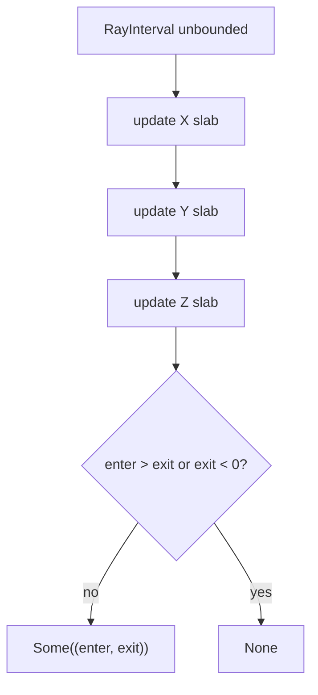
```mermaid
flowchart TD
    start["RayInterval unbounded"]
    x["update X slab"]
    y["update Y slab"]
    z["update Z slab"]
    miss{"enter > exit or exit < 0?"}
    hit["Some((enter, exit))"]
    none["None"]

    start --> x --> y --> z --> miss
    miss -->|no| hit
    miss -->|yes| none
```

#### Ray-Triangle

The ray-triangle path is a fixed-point version of the Moller-Trumbore shape:
compute determinant, reject parallel triangles, compute barycentric `u` and
`v`, reject outside-triangle values, then compute nonnegative `t`.

#### Closest Points

Closest-point routines use explicit region tests:

| Solver | Strategy |
| --- | --- |
| AABB point | Clamp each axis. |
| AABB sphere | Clamp sphere center to AABB, compare squared distance to radius squared. |
| Triangle point | Test vertex regions, edge regions, then face region. |
| Segment pair | Compute segment parameters, clamp `s` and `t`, return two closest points. |

The algorithms return `Option` where the query may fail or miss, and concrete
points where a closest point always exists.

### `bunny-mesh`: Quantized Mesh Layouts And Hashes

`bunny-mesh` owns compact mesh-side data structures.

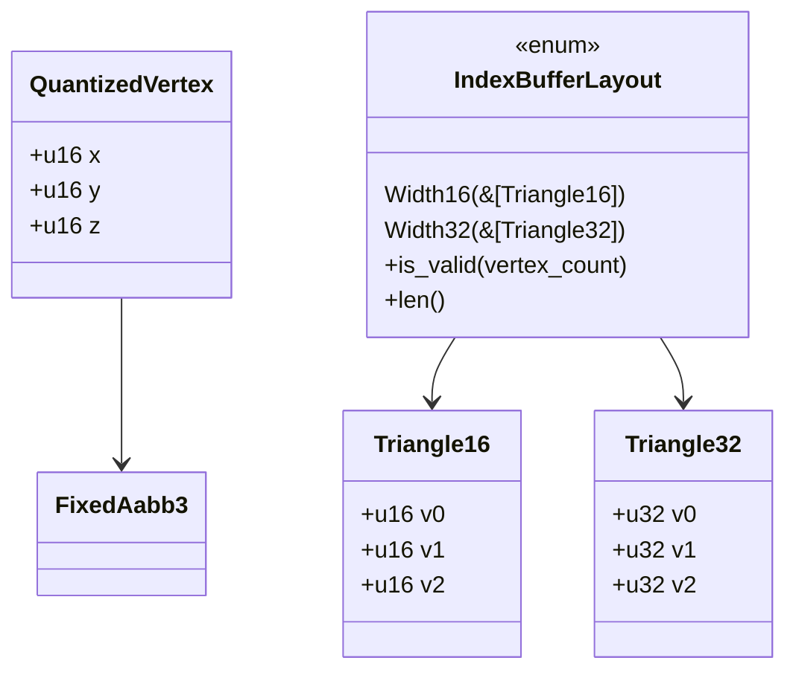
```mermaid
classDiagram
    class QuantizedVertex {
        +u16 x
        +u16 y
        +u16 z
    }
    class Triangle16 {
        +u16 v0
        +u16 v1
        +u16 v2
    }
    class Triangle32 {
        +u32 v0
        +u32 v1
        +u32 v2
    }
    class IndexBufferLayout {
        <<enum>>
        Width16(&[Triangle16])
        Width32(&[Triangle32])
        +is_valid(vertex_count)
        +len()
    }
    QuantizedVertex --> FixedAabb3
    IndexBufferLayout --> Triangle16
    IndexBufferLayout --> Triangle32
```

#### Quantization Payload

The scalar quantization formula maps a fixed value inside `[min, max]` onto
`0..=65535` using ties-to-even rounding.

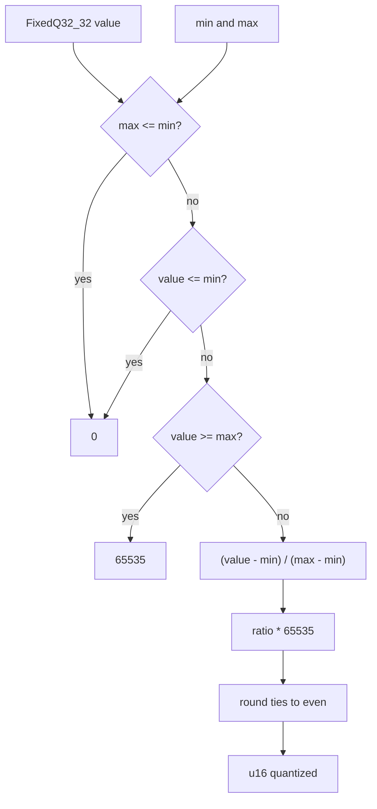
```mermaid
flowchart TD
    value["FixedQ32_32 value"]
    bounds["min and max"]
    degenerate{"max <= min?"}
    below{"value <= min?"}
    above{"value >= max?"}
    ratio["(value - min) / (max - min)"]
    scale["ratio * 65535"]
    round["round ties to even"]
    q["u16 quantized"]

    value --> degenerate
    bounds --> degenerate
    degenerate -->|yes| q0["0"]
    degenerate -->|no| below
    below -->|yes| q0
    below -->|no| above
    above -->|yes| qmax["65535"]
    above -->|no| ratio --> scale --> round --> q
```

#### Mesh Hash Framing

`compute_mesh_hash` frames data before hashing:

1. Domain marker `bunny-mesh:v2`.
2. Six Q32.32 bound coordinates.
3. Vertex count.
4. Quantized vertex bytes.
5. Index layout tag.
6. Face count.
7. Triangle index bytes.

Trade-off: the hash is not just raw buffer hashing. It includes domain and
layout tags so different logical meshes do not collide due to ambiguous
concatenation.

### `bunny-codec`: Mesh Ingress

`bunny-codec` owns external mesh byte/text ingress. It contains three profiles:
binary PLY, text OBJ, and Bunny compressed mesh.

```mermaid
flowchart TD
    input["External mesh input"]
    ply["parse_binary_ply"]
    obj["parse_obj_text"]
    comp["decode_compressed_mesh"]
    plyView["PlyBinaryMesh<'a>"]
    objView["ObjMesh<'a>"]
    compView["CompressedMesh<'a>"]

    input --> ply --> plyView
    input --> obj --> objView
    input --> comp --> compView
```

#### PLY Profile

Accepted PLY is narrow by design:

| Section | Accepted shape |
| --- | --- |
| Header magic | First line `ply` |
| Format | `binary_little_endian 1.0` |
| Vertices | `float x`, `float y`, `float z` |
| Faces | `property list uchar int vertex_indices` |
| Face arity | Exactly three indices |

`PlyBinaryMesh` borrows vertex and face byte slices. Accessors read individual
vertices and triangles on demand.

Unhappy paths include missing header terminator, invalid UTF-8, unsupported
format or property layout, short payload, trailing data, non-triangular faces,
negative indices, out-of-bounds indices, non-finite vertices, and integer
overflow.

#### OBJ Profile

Accepted OBJ is also narrow:

| Record | Handling |
| --- | --- |
| `v x y z` | Parsed as finite `f32` vertex. |
| `f a b c` | Parsed as triangular face, one-based to zero-based indices. |
| `f a/b/c ...` | Auxiliary texture/normal indices may appear if valid. |
| Comments and common metadata | Ignored. |
| Unsupported statements | Rejected. |

The zero-copy design is different from PLY. `ObjMesh` borrows the source text
and scans it for requested records. Full traversal should use `vertices()` and
`triangles()` iterators to avoid repeated scans.

#### Compressed Mesh Profile

The compressed decoder is Bunny-native. It validates the entire header and all
triangle indices before returning a borrowed view.

```mermaid
classDiagram
    class CompressedMesh {
        -FixedAabb3 bounds
        -&[u8] vertex_bytes
        -&[u8] triangle_bytes
        -usize vertex_count
        -usize triangle_count
        -CompressedIndexWidth index_width
        +vertex(index) Result
        +triangle(index) Result
    }
    class CompressedIndexWidth {
        <<enum>>
        Width16
        Width32
    }
    class CompressedTriangle {
        <<enum>>
        Width16(Triangle16)
        Width32(Triangle32)
    }
    CompressedMesh --> CompressedIndexWidth
    CompressedMesh --> CompressedTriangle
```

The important design choice is validation before view construction. Once a
`CompressedMesh` exists, the byte stream has already passed structural checks.
Accessor errors are then about requested record indexes or checked offsets.

### `bunny-broadphase`: Acceleration Structures

`bunny-broadphase` owns broadphase acceleration: BVH, ray/AABB traversal, and
sweep-and-prune.

```mermaid
classDiagram
    class BvhNode {
        +FixedAabb3 bounds
        +u32 first_child_or_prim_idx
        +u32 prim_count
    }
    class TraversalError {
        <<enum>>
        StackOverflow
        InvalidNodeIndex
        InvalidPrimitiveRange
    }
    class SweepAndPrune {
        +sweep_and_prune(pairs, prim_indices, primitives) Option
    }
    BvhNode --> FixedAabb3
    SweepAndPrune --> FixedAabb3
```

#### BVH Build

`build_bvh` validates that caller-provided buffers can hold the result. For `N`
primitives, the worst-case node count is `2N - 1`.

```mermaid
flowchart TD
    primitives["&[FixedAabb3]"]
    buffers["nodes and prim_indices buffers"]
    validate["validate count and capacity"]
    init["initialize primitive indices"]
    bounds["compute bounds for range"]
    split{"accepted split?"}
    leaf["write leaf node"]
    partition["partition primitive order"]
    interior["reserve children and write interior"]
    recurse["recurse left and right"]
    done["Some(node_count)"]
    none["None"]

    primitives --> validate
    buffers --> validate
    validate -->|bad| none
    validate -->|ok| init --> bounds --> split
    split -->|no| leaf --> done
    split -->|yes| partition --> interior --> recurse --> done
```

#### Traversal

Traversal uses a fixed stack of 64 node indexes. That makes stack overflow an
explicit `TraversalError`, not an allocation event.

Trade-off: this is predictable and allocation-free, but malformed or extremely
deep buffers can fail with `StackOverflow`.

#### Sweep-And-Prune

The sweep path chooses the largest centroid-span axis, sorts primitive indexes
by minimum coordinate on that axis, scans forward until the axis can no longer
overlap, and finally sorts emitted pairs lexicographically.

The final pair sort matters. Even if internal ordering changes, public output is
stable.

## External Dependencies And Borders

Bunny's third-party borders are narrow.

| Dependency | Used by | Boundary |
| --- | --- | --- |
| `wesley-core` | `bunny-wesley` | Lowers GraphQL SDL into IR. Bunny owns rendering decisions after that. |
| `sha2` | `bunny-wesley`, `bunny-mesh` | Computes schema hashes and mesh hashes. |
| `syn`, `proc-macro2` | `xtask` | Parses Rust source for Code Dojo AST policy. |
| `cargo-deny` | Code Dojo command | External dependency policy checker. |
| GitHub Actions | CI and release | Runs Code Dojo and release workflow. |
| crates.io | Release script | Final package registry. |
| `wasm-pack` | CI | Headless WebAssembly test runner. |

The runtime libraries do not call external services. The only networked path is
publication and crates.io visibility verification.

## Security Boundaries

Bunny has no user authentication because it is not a service. Security-relevant
boundaries are supply-chain and release boundaries.

```mermaid
flowchart TD
    dev["Developer machine"]
    pr["Pull request"]
    ci["GitHub Actions"]
    release["GitHub Release"]
    secret["CARGO_REGISTRY_TOKEN"]
    crates["crates.io"]

    dev --> pr --> ci
    ci --> release
    release --> secret --> crates
```

| Boundary | Rule |
| --- | --- |
| Pull request CI | Read-only repository permissions. |
| Release workflow checkout | Pinned `actions/checkout` SHA and `persist-credentials: false`. |
| crates.io publish | Requires `CARGO_REGISTRY_TOKEN` only in publish mode. |
| Runtime crates | No network, no user sessions, no secrets. |

## Concurrency And Async Flows

Runtime Bunny code is synchronous. It does not spawn threads, schedule async
tasks, or use background workers.

There is parallelism in CI:

```mermaid
flowchart TD
    pr["PR or push"]
    dojo["Dojo / Ubuntu x64"]
    detLinux["Determinism / ubuntu-latest"]
    detMac["Determinism / macos-26"]
    detWin["Determinism / windows-latest"]
    wasm["WebAssembly / Headless Node"]

    pr --> dojo
    pr --> detLinux
    pr --> detMac
    pr --> detWin
    pr --> wasm
```

That parallelism is orchestration-level, not library-level. The libraries remain
simple synchronous APIs that return values, `Option`, or `Result`.

## Configuration And Environment Tuning

Most runtime crates have no environment configuration. Behavior is encoded in
types and functions. Tooling and release scripts do have knobs.

| Variable | Owner | Effect |
| --- | --- | --- |
| `RUST_TOOLCHAIN` | `scripts/publish-crates.sh` | Selects the Rust toolchain for packaging. Defaults to `1.96.0`. |
| `RELEASE_TAG` | Release script | Guards that the tag matches crate version, for example `v0.5.0`. |
| `ALLOW_DIRTY=1` | Release script | Passes `--allow-dirty` to Cargo packaging commands. This is intentionally visible debt. |
| `CARGO_REGISTRY_TOKEN` | Release script | Required for crates.io publish mode. |
| `CRATES_IO_RETRY_LIMIT` | Release script | Controls registry publish retry attempts. |
| `CRATES_IO_RETRY_SECONDS` | Release script | Controls sleep duration between retry attempts. |
| `VERIFY_REGISTRY_DEPS=1` | Release script | Forces deeper package verification for crates with registry-visible internal dependencies. |

The most sensitive knob is `ALLOW_DIRTY`. It is useful for emergency packaging
diagnostics, but release discipline prefers clean-tree verification.

## Error Handling Philosophy

Bunny uses a small set of failure shapes:

| Shape | Meaning |
| --- | --- |
| `Result<T, E>` | Invalid caller input, malformed external data, or structural failure with a named reason. |
| `Option<T>` | A valid query with no hit, a computation that cannot produce a value, or insufficient caller-provided buffer space. |
| `bool` | Validation predicate where the caller only needs pass/fail, such as `IndexBufferLayout::is_valid`. |
| Process exit code | Tooling and release command success/failure. |

The design avoids panics in core runtime paths. Tooling has more latitude, but
Code Dojo still applies standards.

## Why Bunny Is Built This Way

The main architectural trade-offs are consistent across the workspace.

| Choice | Benefit | Cost |
| --- | --- | --- |
| Fixed-point canonical math | Cross-platform deterministic raw values | More manual rounding, range, and overflow logic |
| Validated float boundaries | External APIs stay ergonomic without contaminating the core | More constructors return `Result` |
| Borrowed codec views | Zero-copy accepted path and clear source of truth | Accessors may re-read records |
| Caller-owned buffers | Predictable allocation behavior | Callers must size buffers correctly |
| Narrow file profiles | Strong validation and deterministic behavior | Bunny rejects many legal PLY/OBJ variants |
| AST-backed local policy | Real structural enforcement | More complex tooling than formatting alone |
| GitHub Issues as backlog truth | Avoids local roadmap mutation drift | Requires tracker hygiene outside the repo files |

## Reading Order For New Contributors

```mermaid
flowchart TD
    start["README.md"]
    teardown["docs/TECHNICAL_TEARDOWN.md"]
    numeric["docs/NUMERIC_CONSTITUTION.md"]
    dojo["docs/CODE_DOJO.md"]
    map["docs/MATH_GEOMETRY_CAPABILITY_MAP.md"]
    crate["crate README and src/lib.rs"]
    tests["determinism and unit tests"]

    start --> teardown
    teardown --> numeric
    teardown --> dojo
    teardown --> map
    map --> crate --> tests
```

A practical path is:

1. Read the glossary and workspace map in this document.
2. Run `cargo run --locked -p xtask -- code-dojo --all`.
3. Read `bunny-num`, `bunny-linalg`, and `bunny-geom` first.
4. Read `bunny-query` next because it shows how fixed data is consumed.
5. Read `bunny-mesh` and `bunny-codec` together because the codec profiles feed
   mesh layouts.
6. Read `bunny-broadphase` last because it composes geometry and query behavior
   into acceleration structures.

## End-To-End Mental Model

The entire repo can be summarized as a sequence of trust transitions.

```mermaid
flowchart LR
    external["External floats, text, bytes, schema"]
    validate["Validate boundary"]
    canonical["Canonical fixed values or borrowed views"]
    compute["Deterministic computation"]
    evidence["Golden tests and receipts"]
    package["Verified package archives"]
    publish["crates.io"]

    external --> validate --> canonical --> compute --> evidence --> package --> publish
```

Bunny's value is not one large algorithm. Its value is the discipline of moving
data across each boundary only after the representation is explicit, validated,
and testable.
